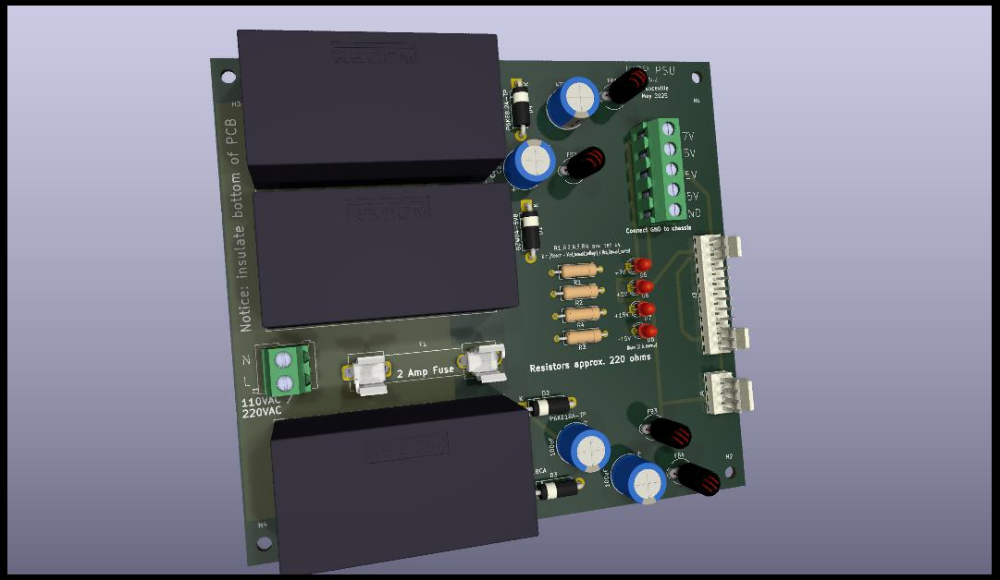

# JX8P_PSU
Replacement power supply for Roland JX8P

The power supply for the Roland JX8P is nearly 40 years old at this point, and if you own a JX8P you should probably be a little concerned about its 
typical manner of failing, which is to spike the +5V rail, which is your logic rail, frying lots of logic chips on your synth.  It is also built 
around heat generating linear regulators, which makes its demise even more likely.

I decided to replace mine preventatively, and this project is the result of that effort.  It's basically three Recom power modules with a common ground, and 
various conditioning components on the output side to make sure we have perfectly smooth rails, despite the fact that these are switching rather than linear 
supplies.  It works fabulously.

The LEDs and resistors near them are optional, but they give you an easy way to identify that all 4 rails are operating properly.  Be aware that this 
PCB is managing mains voltages, so don't take on this project if you don't know what you're doing, or if this is a first attempt at building a PCB.  Don't 
fool with mains voltages unless you know precisely how to protect yourself.

Also be aware that this PCB needs insulation on the bottom of the board.  The JX8P uses a shielded metal foil that is grounded.  You'll get fireworks if you 
just plunk this PCB down and connect it.  I used a sheet of plexiglass, and attached the board and plexiglass to the wooden base of the synth using 6-32 
nylon screws and nuts.

I sourced all the components from Mouser, though you can probably find them anywhere.  

The board has some safety features.  Since what we care about is the synth, I strapped all the rails to some very sturdy zeners that should protect the 
sensitive components of the synth if somehow one of the power units went out of spec.

The total current draw across the fuse is just above 1.5 amps, so a 2 amp fuse should probably be what you use.

I've included a Gerber .zip file, so you can just send the .zip to your favorite PCB fab house.
